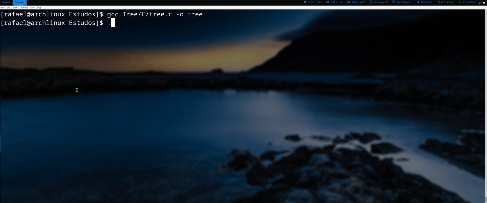

# Projects
All these projects were made by me, either for learning a new concept or just for fun.
You can use the code in any way you may want to, with or without crediting me. The contents are 100% public.

## Image Studio

Image Studio is pet project of mine, perhaps my favorite out of all my personal projects. In this repo I showcase some interesting image processing algorithms and code them entirely by hand. The main goal of Image Studio is to learn to code these algorithms by myself without using already existing image processing libraries.

* [Image Studio Repository](https://github.com/RafaelAmauri/Image-Studio)

Some cool algorithms that I've already implemented:

* Quantization
* Dithering

| **Category**         | **Original Image**                                          | **Quantized  Image (4 Colors)**                                   | **Quantized Image (4 Colors) + Dithering**                                    |
|----------------------|----------------------------------------------------|----------------------------------------------------|-----------------------------------------------------|
| **Dog (Grayscale)**  |      |              |             |
| **Dog (RGB)**     |        |            |          |
| **Duck (Grayscale)**      |            |                    |                   |
| **Duck (RGB)**      |           |             |           |

## Tree

Tree is a project that aims to provide my own implementation of the tree command that can be found in different operating systems. The main goal is have a working implementation that doesn't use any recursion.

* [Tree Repository](https://github.com/RafaelAmauri/Tree)

### Demo

## Kernel Updater

This project asks you for a version of the Linux Kernel and automatically compiles and installs the kernel for you. It allows for some customization such as name of the kernel and compile flags.

* [Kernel Updater Repository](https://github.com/RafaelAmauri/Kernel-Updater)

## Qt Calculator

One of my first tries at developing a GUI-centered application. This is a simple calculator that uses Qt to help me learn how to write GUI software.

* [Qt Calculator Repository](https://github.com/RafaelAmauri/Qt-Calculator)
